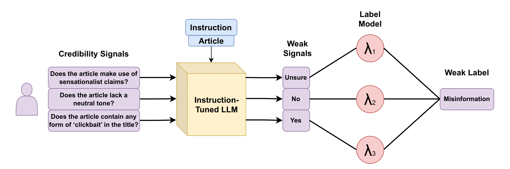

# PASTEL
PASTEL (Prompted weAk Supervision wiTh crEdibility signaLs) is a weakly supervised approach that leverages large language models to extract credibility signals from web content, then further combines them to predict
content veracity without using any ground truth labels. This repository contains the code base to reproduce the experiments presented in our paper [Weakly Supervised Veracity Classification with LLM-Predicted Credibility Signals](https://epjdatascience.springeropen.com/articles/10.1140/epjds/s13688-025-00534-0).




## Reproducing the paper
To run the code, follow these steps:

1. Place the datasets inside the ```data/datasets``` folder. Dataset files must be in a csv format and have the following columns: ```title,text,objective,article_id```.
   
   * title: title of the news article (string).
   * text: body of text of the news article (string).
   * objective: misinformation label, either 0 (non-misinformation) or 1 (misinformation) (integer).
   * article_id: unique identifier for each article (e.g., hash the title + text into an id) (string).

2. Install the dependencies.
   ```shell
   conda install -n pastel python==3.10.4
   conda activate pastel
   pip install -r requirements.txt
   ``` 

3. Extract the credibility signals for the desired dataset.
   ```shell
   python3 scripts/prompt.py --dataset mydataset --model_size=70
   ```
   Supposing your csv is in ```data/datasets/mydataset.csv```.
   The script will save each processed article in a cache file in ```data/cache/mydataset.jsonl```. Once the entire dataset is processed, proceed to the next step. You can choose a smaller model (7 or 13) if you wish.

4. Consolidate the processed cache into a csv file.
   ```shell
   python3 scripts/consolidate.py --dataset mydataset
   ```
   Given that your cache file is in ```data/cache/mydataset.jsonl```, you will find a new csv file in ```data/signals/mydataset.csv```.

5. Train and evaluate the weakly supervised label model using the extracted signals.
   ```shell
   python3 scripts/train_ws.py --dataset mydataset
   ```
   Given that the processed signals are in ```data/signals/mydataset.csv```, there should now be a file named ```mydataset_metrics.json``` in the root folder with the average metrics computed with 10-fold cross validation.

## Supporting Experiments
To run the supporting experiments in the paper, ensure that the four datasets (FakeNewsAMT, Celebrity, PolitiFact, and GossipCop) have been processed and the extracted signals are in ```data/signals/``` (i.e., run the aforementioned steps until step 4).

### Error Analysis
Run the jupyer notebook ```scripts/error_analysis.ipynb```.

### Signal Analysis
Run the jupyter notebook ```scripts/signal_analysis.ipynb```.

### Reproducing the other baselines:
**LLaMa-ZS:** The extracted signals file should contain a column named 'objective_pred', which is the zero-shot prediction for veracity (i.e., the output for the LLaMa-ZS baseline).

**LLaMa-FT**: To fine-tune LLaMa, run the following script:
```shell
python3 scripts/finetune.py --dataset mydataset --model_size 70 --fold 0
 ```
This script will fine-tune the LLM for a specific fold of the dataset (from 0 to 10). To fully reproduce the experiment, you must run the script for all ten folds, and perform inference using the output models.

**RoBERTa and BERT**: to reproduce the state-of-the-art supervised models, run the following script:

```shell
python3 scripts/bert_roberta.py --dataset mydataset --pretrained_model roberta-base
python3 scripts/bert_roberta.py --dataset mydataset --pretrained_model bert-base-uncased
```
The script will output files ```results_roberta-base``` and ```results_bert-base-uncased``` with the cross validation scores for the two baselines.

### Cross-dataset classification
For each pair of train and test datasets, run the following command:
```shell
python3 scripts/cross_dataset --train_dataset dataset1 --test_dataset dataset2
```
A file named ```results_train_dataset1_test_dataset2.json``` should appear containing the classification results for the two datasets. Run again for all pairs of datasets to fully reproduce the experiment.

# Cite this work
```
@article{jaleite-pastel-2025,
	author = {{Leite, João A.} and {Razuvayevskaya, Olesya} and {Bontcheva, Kalina} and {Scarton, Carolina}},
	title = {Weakly supervised veracity classification with LLM-predicted credibility signals},
	DOI= "10.1140/epjds/s13688-025-00534-0",
	url= "https://doi.org/10.1140/epjds/s13688-025-00534-0",
	journal = {EPJ Data Sci.},
	year = 2025,
	volume = 14,
	number = 1,
	pages = "16",
}

```
